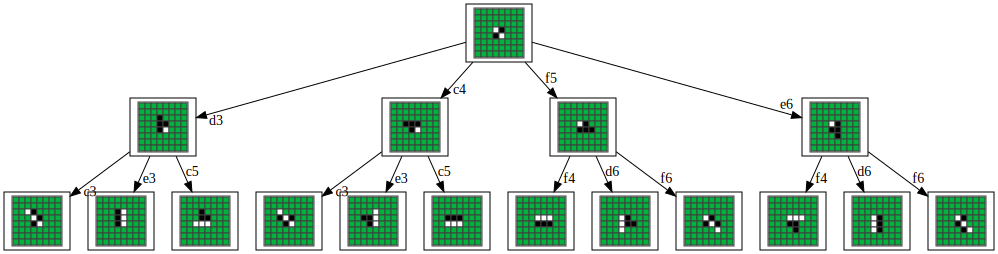

# othello
Type-safe Othello written in Scala

## Play

```bash
sbt "runMain io.github.nwtgck.othello.Main"
```

(In the future, this may be changed.)

## AI

This game has three types of AI for now.

* `RandomPlayer` - moves randomly
* `MonteCarloPlayer` - moves by  Monte Carlo method
* `UguisuEvaluationTablePlayer` - moves by a evalutation table found in <http://uguisu.skr.jp/othello/5-1.html>

## Type-safety

For example, `Disk` and `Cell` are not the same. `Disk` is a subset of `Cell`, mathematically, `Disk ⊂ Cell`.
Because of this definition, `Player` has `Disk`, not `Cell` since `Player` should not have `Empty`, which is a state of a cell.

```scala
/**
  * Cell
  */
sealed trait Cell

/**
  * Disk (Disk is a subset of Cell)
  */
sealed trait Disk extends Cell{
...
}
case object Black extends Disk
case object White extends Disk
case object Empty extends Cell
```

If union types are available like [TypeScript], the type definition will be more clear like the following.
This project will be written in [Dotty] when [Dotty] get more stable.

[TypeScript]: https://www.typescriptlang.org/
[Dotty]: http://dotty.epfl.ch/

```ts
// NOTE: TypeScript
type Cell = "Black" | "White" | "Empty"
type Disk = "Black" | "White"
```


For another example, the parameters of `Game` class ensure to have valid players like the following.

```scala
class Game(player1: Player[Black.type], player2: Player[White.type]) {
 ...
}
```

(The `player1`'s disk is always `Black` and the `player2`'s disk is always white.)

Definition of `Player` abstract class is like the following.
```scala
abstract class Player[+D <: Disk] (val disk: D) {
  ...
}
```

## Game Tree

Game tree is represented as **lazy** tree. So you can get **entire game tree** by the following.

```scala
// The entire game tree of Othello!
GameTree.create(GamePosition(
  board = Board.initial,
  disk  = Black,
  previousMoveOpt = None
))
```

Here is a visualization of the game tree where depth limit = 3.



